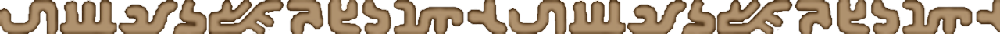
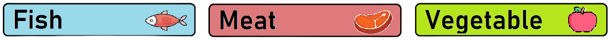
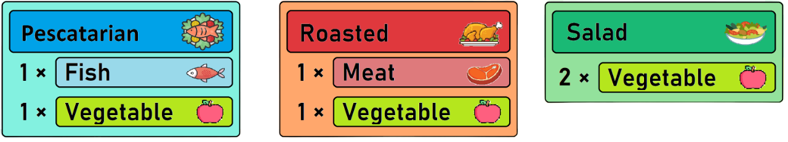

<h1 align="center">
🏹 - Zelda Breath of the Wild - 🛡️  
  

</h1>

  

<h3 align="center">
        <samp>&gt; Hey There!, We are
                <b><a target="_blank">ZeldaHaters</a></b>
        </samp>
</h3>

 
  <samp>
    <a href="https://www.iesesteveterradas.cat/">「 Google Us 」</a>
     
    「 We are a group of multiplatform application development students from Spain</b> 」
     
     
  </samp>

        
<!-- About Section -->

# About us

 

 
  
 ✌️ &emsp; We are learning to program in python  
 ❤️ &emsp; We enjoyed creating this project and have learned a lot  
 📧 &emsp; Reach us anytime: pablovicenteroura2005@gmail.com  
 💬 &emsp; Ask us about anything [here](https://github.com/OscarMG018/DAM1-Projecto-Zelda-/issues)

 

Coded with 💚​ by Óscar Medina, Víctor Valero and Pablo Vicente

  

# Use To Code

 

# Introduction

10,000 years ago, Hyrule was a land of prosperity thanks to the Sheikah  
tribe. The Sheikah were a tribe of warriors who protected  the Triforce,  
a sacred relic that granted wishes.  

But one day, Ganondorf, an evil sorcerer, stole the Triforce and began  
to rule Hyrule with an iron fist. 

The princess, with the help of a heroic young man, managed to defeat  
Ganondorf and recover the Triforce.  

Now history is repeating itself, and Princess Zelda has been captured by  
Ganon. He has taken over the Guardians and filled Hyrule with monsters.  

But a young man named 'Link' has just awakened and  
must reclaim the Guardians to defeat Ganon and save Hyrule.  

  

# Game controls
*Tooltips within the app also explain the keyboard shortcuts for the respective function*

[//]: # "repo main details  -------------------------------------------------------------------------------------------"

#### Map controls

| Action            | Shortcut            | Example               |
|-------------------|---------------------|-----------------------|
| Lineal movement   | *Go 'X' 'direction'* | `Go 10 right`         |
| Relative movement | *Go by the 'symbol'* | `Go by the M`         |
| Region movement   | *Go to 'region'*    | `Go to Gerudo`        |

[//]: # "repo main details  -------------------------------------------------------------------------------------------"

#### Interacion controls

| Action | Definition                         | 
|--------|------------------------------------|
| Attack | `Attacks a nearby entity`   |
| Attack | `Cuts a nearby bush`        |
| Attack | `Hits a nearby tree`     |         
| Fish | `Fishes in a nerby lake`  |         
| Open   | `Opens a chest`     |            
| Open Santuary   | `Opens a sanctuary`  |  

#### Inventory controls

| Action            | Shortcut           | Example               |
|-------------------|--------------------|-----------------------|
| Equip weapon      | *Equip 'weapon'*   | `Equip Wood Sword`    |
| Equip shield      | *Equip 'shield'*   | `Equip Shield`        |
| Unequip weapon    | *Unequip 'weapon'* | `Unequip Sword`       |
| Unequip shield    | *Unequip 'shield'* | `Unequip Wood Shield` |
| Eat item          | *Eat 'food'*       | `Eat Vegetable`       |
| Cook item         | *Cook 'recept'*    | `Cook Salad`          |

[//]: # "repo main details  -------------------------------------------------------------------------------------------"

# 🍖 - Food Items - 🌿 

[//]: # "repo main details  -------------------------------------------------------------------------------------------"

  

[//]: # "repo main details  -------------------------------------------------------------------------------------------"

# 🍲 - Recepts Items - 🥗

[//]: # "repo main details  -------------------------------------------------------------------------------------------"

