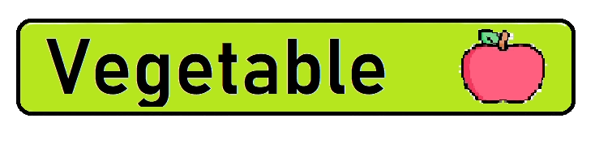
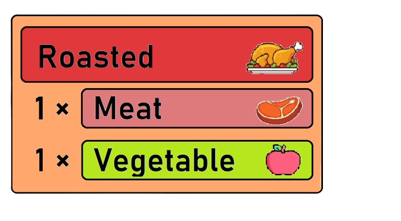

# 🏹 - Zelda Breath of the Wild - 🛡️  

[//]: # "repo main details  -------------------------------------------------------------------------------------------"

Coded with 💚​ by Óscar Medina, Víctor Valero and Pablo Vicente

[//]: # "repo main details  -------------------------------------------------------------------------------------------"

### Game controls
*Tooltips within the app also explain the keyboard shortcuts for the respective function*

[//]: # "repo main details  -------------------------------------------------------------------------------------------"

#### Map controls

| Action            | Shortcut            | Example               |
|-------------------|---------------------|-----------------------|
| Lineal movement   | *Go 'X' 'direction'* | `Go 10 right`         |
| Relative movement | *Go by the 'symbol'* | `Go by the M`         |
| Region movement   | *Go to 'region'*    | `Go to Gerudo`        |

[//]: # "repo main details  -------------------------------------------------------------------------------------------"

#### Interacion controls

| Action | Definition                         | 
|--------|------------------------------------|
| Attack | `Attacks a nearby entity`   |
| Attack | `Cuts a nearby bush`        |
| Attack | `Hits a nearby tree`     |         
| Fish | `Fishes in a nerby lake`  |         
| Open   | `Opens a chest`     |            
| Open Santuary   | `Opens a sanctuary`  |  

#### Food items

#### Recepts

#### Inventory controls

| Action            | Shortcut           | Example               |
|-------------------|--------------------|-----------------------|
| Equip weapon      | *Equip 'weapon'*   | `Equip Wood Sword`    |
| Equip shield      | *Equip 'shield'*   | `Equip Shield`        |
| Unequip weapon    | *Unequip 'weapon'* | `Unequip Sword`       |
| Unequip shield    | *Unequip 'shield'* | `Unequip Wood Shield` |
| Eat item          | *Eat 'food'*       | `Eat Vegetable`       |
| Cook item         | *Cook 'recept'*    | `Cook Salad`          |

[//]: # "repo main details  -------------------------------------------------------------------------------------------"

# 🍖 - Food - 🌿 

[//]: # "repo main details  -------------------------------------------------------------------------------------------"

[//]: # "repo main details  -------------------------------------------------------------------------------------------"

# 🍲 - Recepts - 🥗

[//]: # "repo main details  -------------------------------------------------------------------------------------------"

